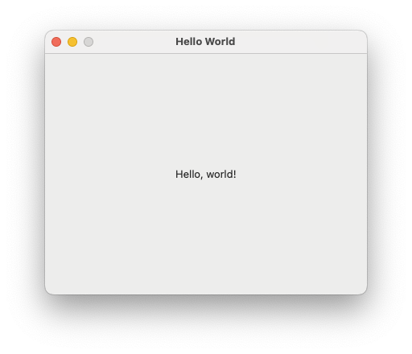

# appkit-without-xcode

A tiny example of a native macOS app built with Objective-C and without Xcode.

## Instructions

From the terminal:

```
$ make
$ make run
```

The app bundle is `Hello.app`.

## Screenshot



## License

Copyright (c) 2025 [Fernando Borretti](https://borretti.me/)

Released under the MIT license.
